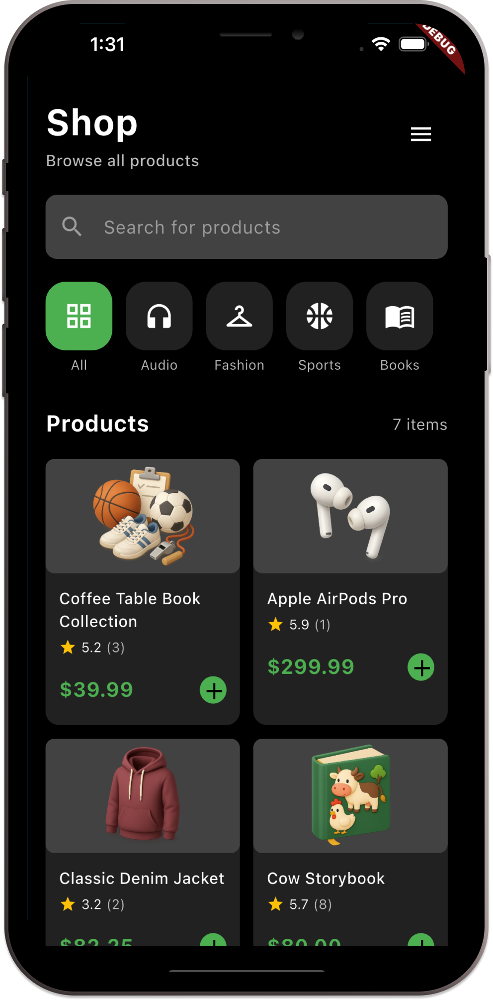

# ecommerce_flutter_getx

E-commerce Shop App - Flutter (GetX)

A modern, high-performance E-commerce application built with Flutter and GetX . The app features a sleek dark-themed UI for browsing products, managing categories, and seamless state management.

Screenshots

  

Features

Dynamic Category Navigation: Quickly filter products through categories like All, Audio, Fashion, Sports, and Books.

Product Grid View: Clean card layout displaying high-quality product images, titles, star ratings, and prices.

Reactive State Management: Powered by GetX for real-time updates of the product list and shopping cart.

Integrated Search: A prominent search bar allowing users to find specific products instantly.

Quick Add to Cart: Convenient "plus" action buttons on each product card for immediate selection.

Tech Stack
Framework: Flutter
State Management: GetX (Obx, GetxController)
